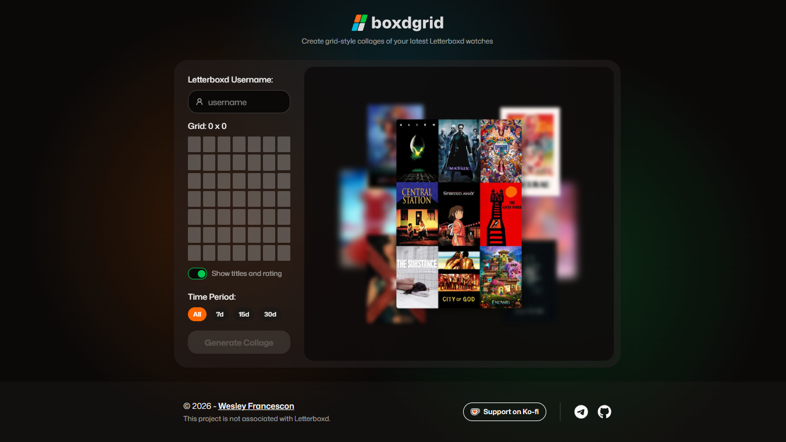

#  boxdgrid

Generate grid-style collages of your latest Letterboxd watches.

[](https://boxdgrid.com)

## Preview



## About

**boxdgrid** is a web app built with [Deno Fresh](https://fresh.deno.dev) that
lets you generate grid-style collages using movie posters from your
[Letterboxd](https://letterboxd.com) account.

You can choose different grid sizes and also filter films by a time period (for
example, the last 30 days).

## Usage

1. Access: https://boxdgrid.com
2. Enter your Letterboxd username
3. Select a grid size (e.g. 3×3, 4×4, 5×5)
4. Optionally filter by a time range (e.g. last 30 days)
5. Generate and download your collage

## Running locally

### Requirements

- [Deno](https://deno.com) installed (recommended latest version)

### Installation

```bash
git clone https://github.com/wfrancescons/boxdgrid.git
cd boxdgrid
```

### Run the project

```bash
deno task dev
```

## Tech Stack

- Deno Fresh
- Preact (via Fresh)
- Tailwind CSS
- daisyUI

## Notes

- Uses public Letterboxd data (no authentication required)
- Collages are generated dynamically in the browser

## Support

If you find this project useful, consider supporting it:

<a href="https://ko-fi.com/wfrancescons" target="_blank">
  
</a>
